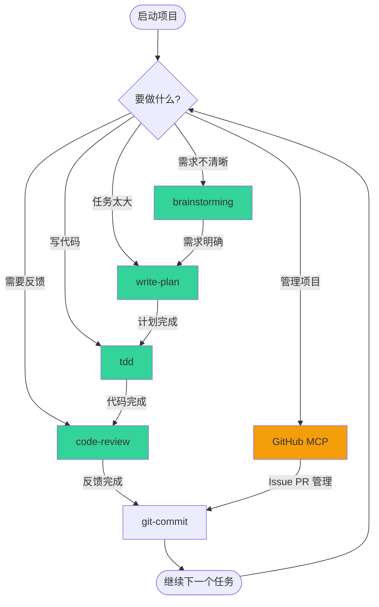
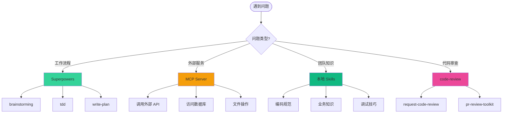

# Claude Code 实战分享：用 Skills、Plugins 和 MCP 构建 YouTube MCP 服务器

> 这不是一篇关于"什么是 Skills/Plugins/MCP"的理论文档。本文分享我们开发 youtube-mcp-server 的真实经历：我们遇到了什么问题，用了什么工具，学到了什么。

---

## 目录

1. [我们解决了什么问题](#我们解决了什么问题)
2. [youtube-mcp-server 是什么](#youtube-mcp-server-是什么)
3. [我们是这么做的](#我们是这么做的)
4. [关键发现：它们不是魔法](#关键发现：它们不是魔法)
5. [实用组合模式](#实用组合模式)
6. [快速参考](#快速参考)

---

## 从项目中学习：如何有效使用 Claude Code <a name="从项目中学习如何有效使用-claude-code"></a>

### 项目背景

youtube-mcp-server 是一个连接 YouTube Data API 的 MCP 服务器。在开发这个项目时，我们系统化地使用了 Claude Code 的各种工具。

### 我们学到了什么

通过这个项目，我们对 Claude Code 的工具有了切身体会：

| 工具 | 我们以为的 | 实际情况 | 学到的东西 |
|------|-----------|-----------|----------|
| **Skills** | 把文档喂给 Claude 它就"学会"了 | 只是结构化提示词模板，每次重新读取 | ❌ 不要堆文档，✅ 提供清晰步骤 |
| **Plugins** | 安装了就有新能力 | 只是分发机制，里面是 Skills/MCP/Commands | ❌ 当增强器，✅ 当团队标准化载体 |
| **MCP** | 让 Claude 变聪明 | 只是调用外部工具的协议 | ❌ 期望自动处理错误，✅ 必须在服务端写好 |

### 三大核心工具在项目中的实际用法

---

## youtube-mcp-server 是什么 <a name="youtube-mcp-server-是什么"></a>

一句话解释：**它是一个让 Claude 能访问 YouTube 数据的 MCP 服务器。**

### 我们提供什么

| 工具 | 功能 | 使用场景 |
|------|------|----------|
| `search_videos` | 搜索 YouTube 视频 | 用户问"给我找 Claude Code 教程" |
| `get_video` | 获取视频详情 | 用户问"这个视频表现如何" |
| `list_comments` | 获取视频评论 | 用户问"大家对这个视频什么评价" |
| `get_channel` | 获取频道信息 | 用户问"这个频道有多少订阅" |
| `list_playlist_items` | 获取播放列表 | 用户问"这个列表有什么视频" |

### 如何使用

1. **配置 MCP**：在 `~/.claude/mcp_config.json` 添加配置，使用 `npx -y @your-username/youtube-mcp-server`
2. **设置环境变量**：`export YOUTUBE_API_KEY=your_key`
3. **直接对话**：问 Claude "搜索关于 React 的教程视频"，它会自动调用我们的 MCP 工具

就这么简单。

---

## 我们是怎么做的 <a name="我们是这么做的"></a>

### 开发全流程

这不是一个"先学理论再动手"的过程。我们从第一天就在用 Claude Code 的扩展工具：

<div align="center">



</div>

### 每个工具的真实用法

**需求探索阶段 - brainstorming：**

```
我: /superpowers:brainstorm

Claude: 让我们设计 YouTube MCP 服务器的整体架构。

我: 三层架构？MCP、API、Skills

Claude: 对。让我帮你设计：

## 架构设计
- **MCP Layer**：使用 mcp.server.fastmcp 实现 stdio 通信
- **YouTube API Layer**：用 google-api-python-client 封装调用
- **Skill Layer**：高级工作流（如"分析视频字幕"、"找热门视频"）

## 工具分组
**Search & Discovery**：
- youtube_search - 搜索视频、频道、播放列表
- youtube_get_video - 获取视频详情
- youtube_get_channel - 获取频道信息

**Content Analysis**：
- youtube_get_transcript - 获取字幕
- youtube_get_comments - 获取评论

**Playlist Management**：
- youtube_get_playlist - 获取播放列表
- youtube_list_playlists - 列出播放列表

## 错误处理
- Quota Exceeded - 返回友好提示（每天 10,000 单位）
- Invalid ID - 调用前验证 YouTube ID
- Network Errors - 重试 3 次，指数退避

这个架构可以吗？

我: 可以
```

**任务分解阶段 - write-plan：**

```
我: /superpowers:write-plan

Claude: 正在读取设计文档...

生成了 17 个任务：

**Task 1-3: 项目基础**
- Task 1: 配置文件
- Task 2: 项目结构
- Task 3: 环境变量加载

**Task 4-11: MCP 工具**
- Task 4: YouTube API Client 初始化
- Task 5: Search 工具实现
- Task 6: Video Details 工具
- Task 7: Transcript 工具
- Task 8: Playlist 工具
- Task 9: Comments 工具
- Task 10: Channel 工具
- Task 11: Analytics 工具

**Task 12-16: Skills 和文档**
- Task 12: 整合所有工具到主服务器
- Task 13: YouTube Search Skill
- Task 14: Transcript Skill
- Task 15: Playlist Skill
- Task 16: README 文档

**Task 17: 最终验证**

每个任务包含：
- 具体的文件路径
- 代码片段
- 命令
- 预期输出

准备开始实现？

我: 好
```

**关于开发方式的说明**：

对话中显示了 `subagent-driven` 开发模式（17 个任务，每个 2 轮审查），这种方式**太慢了**。

**教训**：如果任务多（>10 个），直接快速实现比每次审查更高效。

### 这就是真实用法

不是教科书里的"应该这样"，而是开发中"实际这样"：
- **brainstorming** 是深度设计，不只是问几个问题
- **write-plan** 生成完整任务列表，不是简单清单
- **subagent-driven** 适合复杂项目，但小项目可能太快了

---

## 关键发现：它们不是魔法 <a name="关键发现：它们不是魔法"></a>

开发完 youtube-mcp-server 后，我们对这三样东西的理解变了。

### Skills 不是"注入知识"

**我们以为的**：把整个技术文档喂给 Claude，它就"学会"了

**实际情况**：

- Skills 只是**结构化的使用说明**
- Claude 每次使用时都会重新读取 SKILL.md
- 它不是训练模型，而是给 Claude"提示词模板"
- 如果指令不清晰，Claude 不会自己"理解"

**教训**：
- ❌ 不要把整个文档扔进 SKILL.md
- ✅ 提供清晰的步骤、约束和示例
- ❌ 期望 Claude 能"举一反三"
- ✅ 把边界条件和错误情况写清楚

### Plugins 不是"增强能力"

**我们以为的**：安装一个 Plugin，Claude 就多了新能力

**实际情况**：

- Plugin 只是**分发机制**，里面打包的是 Skills/MCP/Commands
- 安装 Superpowers 不是装了新功能，是装了一套"工作流技能"
- 它的真正价值：团队可以一键安装相同的工作环境

**教训**：
- ❌ 把 Plugin 当作功能增强器
- ✅ 把 Plugin 当作团队标准化的载体
- ❌ 以为 Plugin 越多越好
- ✅ 团队统一几个核心 Plugin 就够

### MCP 不是"AI 增强器"

**我们以为的**：MCP 让 Claude 变得更智能

**实际情况**：

- MCP 只是**协议**，定义了如何调用外部工具
- Claude 本身没有变聪明，只是"能调用更多工具"
- 代码还是我们写的，逻辑还是我们定义的

**教训**：
- ❌ 以为 MCP 会自动处理错误
- ✅ 必须在 MCP Server 里写好错误处理
- ❌ 以为 Claude 会自动优化调用
- ✅ 工具设计要清晰简单，参数要直观

---

## 实用组合模式 <a name="实用组合模式"></a>

基于我们的经验，以下组合确实好用：

### 模式 1：工作流规范 + 项目管理

```
Superpowers Plugin + GitHub MCP
```

**适用场景**：团队协作开发

**实际效果**：

| 开发阶段 | 使用的工具 |
|----------|-----------|
| 需求梳理 | `/superpowers:brainstorming` |
| 任务分解 | `/superpowers:write-plan` |
| 代码开发 | `/superpowers:tdd` |
| 代码审查 | `/superpowers:request-code-review` |
| 创建 Issue | GitHub MCP 工具 |
| 管理 PR | GitHub MCP 工具 |

**为什么好用**：
- 工作流统一，新成员上手快
- 代码质量有保障
- 项目管理不离开 Claude

### 模式 2：外部 API + 本地知识

```
自定义 MCP Server + 本地 Skills
```

**适用场景**：对接第三方服务

**我们的做法**：

```
MCP (youtube-mcp-server)
  ├─ 提供 YouTube API 调用
  └─ 专注协议和工具设计

Skills (.claude/skills/youtube/)
  ├─ API quota 管理策略
  ├─ 错误处理最佳实践
  └─ 工具命名规范
```

**为什么好用**：
- MCP 专注技术实现
- Skills 专注领域知识
- 职责分离，易维护

### 模式 3：前端设计 + 代码生成

```
frontend-design Plugin + 直接对话
```

**适用场景**：UI/UX 开发

**实际用法**：

```
我: /frontend-design

Claude: 你要设计什么界面？
我: 视频搜索结果页，卡片式布局

Claude: 根据设计指南，建议：
        - 使用 Material Design 风格
        - 卡片要有 hover 效果
        - 搜索框放顶部，固定

我: 帮我生成代码

Claude: [生成符合设计规范的 React 代码]
```

### 不推荐的模式

```
❌ 安装一堆 Plugin，实际用不上
❌ 把所有文档都塞进 Skills
❌ 每个 API 都搞一个 MCP Server
❌ 以为有了工具就能自动化一切
```

---

## 快速参考 <a name="快速参考"></a>

### 什么时候用哪个？

<div align="center">



</div>

### 最常用命令

```bash
# Superpowers 工作流
/superpowers:brainstorming      # 交互式需求梳理
/superpowers:tdd              # 测试驱动开发
/superpowers:write-plan        # 任务分解
/superpowers:request-code-review  # 代码审查

# GitHub 项目管理
claude mcp list              # 查看 MCP 服务器
claude mcp add github -- npx -y @modelcontextprotocol/server-github

# 本地 Skills
mkdir -p .claude/skills/my-skill
# 编辑 SKILL.md

# Plugins 管理
/plugin install superpowers@marketplace
/plugin list
```

### 安全提醒

❌ **不要**硬编码 API Key：

```json
"YOUTUBE_API_KEY": "AIzaSy..."
```

✅ **使用环境变量**：

```json
"YOUTUBE_API_KEY": "${YOUTUBE_API_KEY}"
```

在 shell 中设置：

```bash
export YOUTUBE_API_KEY=your_key_here
```

---

## 资源链接

- [Claude Code 文档](https://code.claude.com)
- [Superpowers Plugin](https://github.com/...) - 包含 13 个实用技能
- [MCP 服务器集合](https://github.com/modelcontextprotocol/servers)
- [我们的项目](https://github.com/.../youtube-mcp-server)

---

**文档版本**: 2.0
**最后更新**: 2026-01-28
